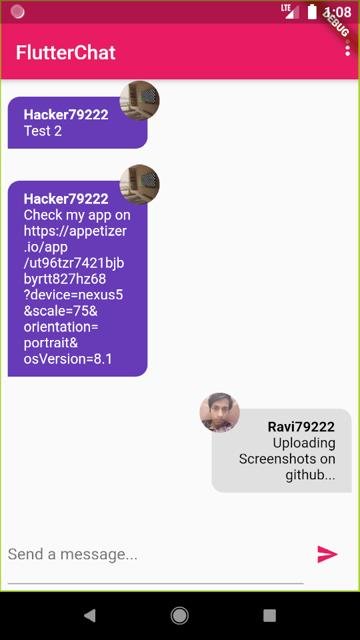

# Chat_app

A flutter chat app built with Firestore and Firebase Cloud(Udemy - Maximilian)

Check My App Here https://appetize.io/app/ut96tzr7421bjbbyrtt827hz68?device=nexus5&scale=75&orientation=portrait&osVersion=8.1

  

## Getting Started

This project is a starting point for a Flutter application.

A few resources to get you started if this is your first Flutter project:

- [Lab: Write your first Flutter app](https://flutter.dev/docs/get-started/codelab)
- [Cookbook: Useful Flutter samples](https://flutter.dev/docs/cookbook)

For help getting started with Flutter, view our
[online documentation](https://flutter.dev/docs), which offers tutorials,
samples, guidance on mobile development, and a full API reference.
